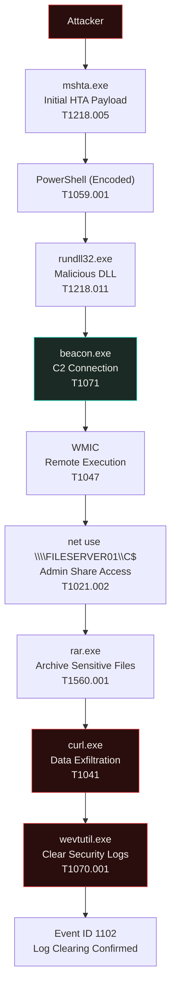

<div align="center">

# 🕵️ Investigation 28 — EDR Multi-Stage Intrusion Detection


*A full living-off-the-land (LOLBins) intrusion — from remote HTA payload to C2, lateral movement, data theft, and anti-forensics — reconstructed end-to-end using EDR telemetry in Splunk.*

</div>

---

## 📌 Executive Summary

A multi-stage endpoint compromise was identified in the internal Windows environment. The attacker executed malicious code through `mshta.exe`, launched **encoded PowerShell**, loaded a malicious DLL via `rundll32.exe`, established a **C2 beacon**, performed **remote execution** with WMIC, accessed an administrative SMB share via `net.exe`, archived sensitive data with `rar.exe`, exfiltrated it externally using `curl.exe`, and finally attempted to cover its tracks by clearing the Windows Security log.

No evidence of Mimikatz/LSASS credential dumping, PsExec usage, or persistence mechanisms was found in this dataset.

**Overall Incident Severity: 🔴 Critical**

---

## 🎯 Objective

Investigate a multi-stage endpoint compromise using EDR telemetry — identify attacker execution methods, lateral movement, privilege escalation attempts, log tampering, and determine whether persistence or successful credential dumping occurred.

---

## 🗂️ Dataset

| | |
|---|---|
| **File** | `investigation28_edr_multi_stage_intrusion.csv` |
| **Platform** | Splunk Enterprise |
| **Total Events** | 90 |
| **Investigation Type** | EDR / Multi-Stage Intrusion Analysis |

---

## 📊 Dataset Overview

### Event Distribution
```spl
index=* source="investigation28_edr_multi_stage_intrusion.csv"
| stats count by event_id
```

| Event ID | Count | Description |
|---|---:|---|
| 4688 | 88 | Process Creation |
| 1102 | 1 | Audit Log Cleared |
| 5156 | 1 | Network Connection Allowed |

### Severity Distribution
```spl
index=* source="investigation28_edr_multi_stage_intrusion.csv"
| stats count by severity
```

| Severity | Count |
|---|---:|
| Low | 80 |
| High | 7 |
| Critical | 3 |

The **10 High/Critical events** (~11% of total) represent the actual intrusion chain — the rest is legitimate background noise, exactly the kind of signal-to-noise ratio a real SOC triage has to cut through.

---

## 👤 User & Host Activity

```spl
index=* source="investigation28_edr_multi_stage_intrusion.csv"
| stats count by user | sort -count
```

| User | Events |
|---|---:|
| administrator | 21 |
| alex.morgan | 20 |
| emma.smith | 19 |
| john.doe | 17 |
| it.admin | 12 |
| SYSTEM | 1 |

```spl
index=* source="investigation28_edr_multi_stage_intrusion.csv"
| stats count by hostname | sort -count
```

| Host | Events |
|---|---:|
| FILESERVER01 | 20 |
| HR-PC01 | 16 |
| WS-102 | 15 |
| DC01 | 14 |
| FIN-01 | 14 |
| WS-101 | 11 |

`HR-PC01`, `DC01`, and `FILESERVER01` form the complete attack chain — initial execution, domain-adjacent activity, and the file share ultimately accessed and archived from.

---

## 🚨 Suspicious Process Timeline

```spl
index=* source="investigation28_edr_multi_stage_intrusion.csv"
| stats count by process_name | sort -count
```

**Baseline (normal) activity:** `chrome.exe` · `notepad.exe` · `excel.exe` · `svchost.exe` · `teams.exe` · `explorer.exe`

**Suspicious activity — the full intrusion chain:**

| Step | Process | Command | MITRE ATT&CK |
|---|---|---|---|
| 1 | `mshta.exe` | Remote HTA payload execution | T1218.005 – Signed Binary Proxy Execution |
| 2 | `powershell.exe` | Encoded command (`-enc`), possible obfuscation | T1059.001 – PowerShell |
| 3 | `rundll32.exe` | Malicious DLL execution | T1218.011 – Rundll32 |
| 4 | `beacon.exe` | C2 communication established | T1071 – Application Layer Protocol |
| 5 | `wmic.exe` | Remote process execution | T1047 – WMIC Remote Execution |
| 6 | `net.exe` | Administrative SMB share access (`net use`) | T1021.002 – SMB Admin Share |
| 7 | `rar.exe` | Sensitive files archived | T1560.001 – Archive Collected Data |
| 8 | `curl.exe` | Archive uploaded to remote server | T1041 – Exfiltration Over Web |
| 9 | `wevtutil.exe` | Security log cleared (`cl Security`) | T1070.001 – Clear Windows Event Logs |

Every tool here is a **living-off-the-land binary (LOLBin)** — a legitimate, pre-installed Windows utility repurposed for malicious ends. No custom malware was dropped, which is exactly what makes this pattern hard to catch with signature-based detection alone.

---

## 🔍 High & Critical Event Triage

```spl
index=* source="investigation28_edr_multi_stage_intrusion.csv"
(severity="High" OR severity="Critical")
| table timestamp user hostname process_name command_line severity description
```

Key findings: initial execution via `mshta.exe` → encoded PowerShell → DLL execution via `rundll32.exe` → C2 beacon activity → remote execution via `wmic.exe` → administrative share access via `net.exe` → file archive via `rar.exe` → data upload via `curl.exe` → Security log clearing via `wevtutil.exe`.

### Encoded PowerShell Detection
```spl
index=* source="investigation28_edr_multi_stage_intrusion.csv"
process_name="powershell.exe"
| table timestamp user hostname command_line description
```
**Finding:** PowerShell executed with an encoded command (`-enc`), indicating likely obfuscation.

---

## 🔬 Investigation Results — What Was Checked and Ruled Out

A thorough investigation is defined as much by what's actively ruled out as by what's found. Each of the following was checked with its own targeted search rather than assumed.

### Credential Dumping
```spl
index=* source="investigation28_edr_multi_stage_intrusion.csv"
(process_name="mimikatz.exe" OR command_line="*sekurlsa*" OR command_line="*lsass*")
```
**Result:** No events found. **Conclusion:** No evidence of Mimikatz execution or LSASS credential dumping.

### Lateral Movement Tooling
```spl
index=* source="investigation28_edr_multi_stage_intrusion.csv"
(process_name="wmic.exe" OR process_name="net.exe" OR process_name="psexec.exe")
```
**Result:** WMIC remote execution and administrative SMB share access confirmed. **No PsExec activity observed.**

### Persistence
Reviewed scheduled tasks, registry Run keys, startup folders, services, and autoruns.
**Result:** No persistence mechanisms identified in this dataset.

### Data Exfiltration
Observed `rar.exe` archiving sensitive files, followed by `curl.exe` uploading the archive to a remote server.
**Result: Confirmed.** Evidence of successful data staging and exfiltration.

### Log Tampering
Observed `wevtutil cl Security`, corroborated by Windows Event ID 1102.
**Result: Confirmed.** Security Event Logs were intentionally cleared by the attacker.

| Check | Result |
|---|---|
| Credential Dumping (Mimikatz / LSASS) | ❌ Not observed |
| PsExec Lateral Movement | ❌ Not observed |
| Persistence (tasks / registry / services / startup) | ❌ Not observed |
| WMIC Remote Execution | ✅ Confirmed |
| SMB Admin Share Access | ✅ Confirmed |
| Data Archiving & Exfiltration | ✅ Confirmed |
| Security Log Tampering | ✅ Confirmed |

---

## ⏱️ Attack Timeline

| Time | Activity |
|---|---|
| 09:20 | Initial execution via `mshta.exe` |
| 09:21 | Encoded PowerShell executed |
| 09:22 | DLL loaded via `rundll32.exe` |
| 09:23 | Beacon established to attacker C2 |
| 09:24 | Remote execution via WMIC |
| 09:25 | Administrative share accessed (`net use`) |
| 09:26 | Sensitive data archived (`rar.exe`) |
| 09:27 | Archive uploaded via `curl.exe` |
| 09:28 | Windows Security logs cleared (`wevtutil`) |
| 09:29 | Event ID 1102 confirms Security Log cleared |

---

## 🔗 Attack Flow



*(Renders automatically on GitHub — no image upload needed.)*

---

## 🗺️ MITRE ATT&CK Mapping

| Technique | MITRE ID |
|---|---|
| MSHTA Execution (Signed Binary Proxy Execution) | T1218.005 |
| PowerShell | T1059.001 |
| Rundll32 | T1218.011 |
| Command & Control Beacon (Application Layer Protocol) | T1071 |
| WMIC Remote Execution | T1047 |
| SMB Admin Share | T1021.002 |
| Archive Collected Data | T1560.001 |
| Exfiltration Over Web | T1041 |
| Clear Windows Event Logs | T1070.001 |

---

## 🧠 Analyst Notes: Evidence vs. Assumption

Six user accounts appear in this dataset, and the administrator account is tied to the largest share of activity. It's tempting to declare outright that "the administrator account was compromised" — but that conclusion isn't fully supported by process telemetry alone.

> **What the evidence supports:** Multiple accounts were active during the investigation window. The administrator account generated the most events and is associated with the attack chain. This is *consistent with* legitimate admin compromise, attacker privilege escalation, or stolen administrative credentials — but **without authentication logs, none of these can be confirmed over the others.**

The same discipline applies to the negative findings: Mimikatz, PsExec, and persistence weren't assumed absent — each was actively searched for, and the query used to rule it out is documented above. A negative result backed by a specific search is just as valuable to the next analyst as a positive one.

---

## 📝 Analyst Conclusion

The investigation identified a complete multi-stage intrusion beginning with MSHTA execution, followed by obfuscated PowerShell commands and malicious DLL execution via Rundll32. The attacker established C2 communication, executed remote commands through WMIC, accessed administrative SMB shares, archived sensitive files, and exfiltrated the archive using curl. Finally, Windows Security Event Logs were cleared using Wevtutil to hinder forensic investigation.

No evidence of credential dumping with Mimikatz or persistence mechanisms was observed. The attack demonstrates a successful intrusion combining living-off-the-land execution, command and control, lateral SMB access, data exfiltration, and defense evasion — consistent with a coordinated, multi-stage MITRE ATT&CK-mapped campaign.

**Recommended response:** classify as a Critical security incident requiring immediate host isolation, credential rotation, and forensic acquisition prior to remediation.

---

## 🎯 Skills Demonstrated

- Splunk SPL (Search Processing Language)
- EDR telemetry investigation & multi-stage attack analysis
- Living-off-the-land binary (LOLBins) detection — `mshta`, `rundll32`, `wmic`, `curl`, `wevtutil`
- Encoded/obfuscated PowerShell detection
- C2 beacon identification and network indicator analysis
- Lateral movement detection (WMIC, SMB admin shares, PsExec elimination)
- Persistence-mechanism hunting (tasks, registry, services, startup, autoruns)
- Data exfiltration analysis and log-tampering detection
- MITRE ATT&CK technique mapping across the full kill chain
- Incident timeline & attack-flow reconstruction
- Evidence-based analyst reporting — separating confirmed findings from plausible-but-unproven theories

---

## ⚠️ Disclaimer

This is a **simulated investigation** created for educational and portfolio purposes. All hostnames, IP addresses, usernames, and IOCs are fictional and do not represent any real organization or individual.

---

## 📂 Repo Contents

```
├── README.md
├── investigation28_edr_multi_stage_intrusion.csv   # Source dataset
├── logs/                  # (Optional) supporting raw log exports
├── timeline.md            # (Optional) detailed timeline breakdown
└── attack-mapping.md      # (Optional) full MITRE ATT&CK reference
```

---

*Part of my [SOC Investigation Portfolio](../) — 28 of 40 enterprise investigations completed.*
