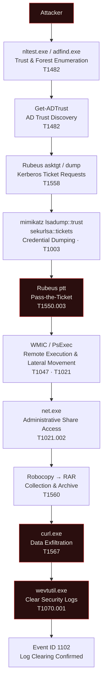

<div align="center">

# 🕵️ Investigation 29 — Active Directory Trust Abuse


*Trust enumeration → Kerberos ticket abuse → Pass-the-Ticket → lateral movement across a trusted Domain Controller → data theft → log tampering, reconstructed end-to-end in Splunk.*

</div>

---

## 📌 Scenario

An attacker compromised a workstation and abused Active Directory **trust relationships** to enumerate trusted domains, request and dump Kerberos tickets, extract trust keys, move laterally to a trusted Domain Controller via a **Pass-the-Ticket** attack, access administrative shares, collect sensitive financial files, exfiltrate the data, and clear Windows Security logs to cover their tracks.

**Overall Incident Severity: 🔴 Critical**

---

## 🎯 Detection Goal

Identify indicators of Active Directory trust abuse, Kerberos ticket attacks, lateral movement, administrative share access, data exfiltration, and log tampering.

---

## 🗂️ Data Source

| | |
|---|---|
| **Platform** | Splunk Enterprise |
| **File** | `investigation29_active_directory_trust_abuse.csv` |
| **Total Events** | 99 |
| **Investigation Type** | Active Directory Trust Abuse / Kerberos Ticket Attack |

---

## 📊 Event Summary

```spl
index=* source="investigation29_active_directory_trust_abuse.csv"
| stats count by event_id
```

| Event ID | Count | Description |
|---|---:|---|
| 4688 | 97 | Process Creation |
| 1102 | 1 | Audit Log Cleared |
| 5156 | 1 | Network Connection |

### Severity Distribution
```spl
index=* source="investigation29_active_directory_trust_abuse.csv"
| stats count by severity
```

| Severity | Count |
|---|---:|
| Critical | 11 |
| High | 9 |
| Medium | 2 |
| Low | 77 |

**20 of 99 events (≈20%) are High/Critical** — a higher-than-usual signal ratio for this portfolio, reflecting how dense a full trust-abuse kill chain is once discovery, credential theft, lateral movement, collection, exfiltration, and anti-forensics are all present in one dataset.

---

## 👤 User & Host Activity

```spl
index=* source="investigation29_active_directory_trust_abuse.csv"
| stats count by user | sort -count
```

| User | Events |
|---|---:|
| administrator | 21 |
| alex.morgan | 19 |
| emma.smith | 19 |
| it.admin | 19 |
| john.doe | 19 |
| SYSTEM | 2 |

```spl
index=* source="investigation29_active_directory_trust_abuse.csv"
| stats count by hostname | sort -count
```

| Host | Events |
|---|---:|
| FIN-01 | 19 |
| HR-PC01 | 19 |
| WS-101 | 19 |
| WS-102 | 19 |
| DC01 | 12 |
| FILESERVER02 | 6 |
| TRUST-DC01 | 5 |

`DC01`, `TRUST-DC01`, and `FILESERVER02` carry the full weight of the attack chain despite having the fewest total events — a reminder that event *count* and event *significance* are not the same thing.

---

## 🚨 Suspicious Processes Observed

```spl
index=* source="investigation29_active_directory_trust_abuse.csv"
| stats count by process_name | sort -count
```

`nltest.exe` · `adfind.exe` · `PowerShell.exe` · `Rubeus.exe` · `mimikatz.exe` · `klist.exe` · `wmic.exe` · `PsExec.exe` · `net.exe` · `robocopy.exe` · `rar.exe` · `curl.exe` · `wevtutil.exe`

---

## 🔍 High & Critical Event Triage

```spl
index=* source="investigation29_active_directory_trust_abuse.csv"
(severity="High" OR severity="Critical")
| table timestamp user hostname process_name command_line severity description
```

### Active Directory Trust Enumeration
```spl
index=* source="investigation29_active_directory_trust_abuse.csv"
(process_name="nltest.exe" OR process_name="adfind.exe")
| table timestamp user hostname process_name command_line description
```

### Kerberos Abuse Detection
```spl
index=* source="investigation29_active_directory_trust_abuse.csv"
(process_name="rubeus.exe" OR process_name="klist.exe")
| table timestamp user hostname process_name command_line description
```

### Mimikatz Detection
```spl
index=* source="investigation29_active_directory_trust_abuse.csv"
process_name="mimikatz.exe"
| table timestamp user hostname process_name command_line severity description
```

### Pass-the-Ticket Detection
```spl
index=* source="investigation29_active_directory_trust_abuse.csv"
command_line="*ptt*"
| table timestamp user hostname process_name command_line description
```

### Remote Execution
```spl
index=* source="investigation29_active_directory_trust_abuse.csv"
(process_name="wmic.exe" OR process_name="psexec.exe")
| table timestamp user hostname process_name command_line description
```

### Administrative Share Access
```spl
index=* source="investigation29_active_directory_trust_abuse.csv"
process_name="net.exe"
| table timestamp user hostname process_name command_line description
```

### Data Exfiltration
```spl
index=* source="investigation29_active_directory_trust_abuse.csv"
(process_name="curl.exe" OR process_name="robocopy.exe" OR process_name="rar.exe")
| table timestamp user hostname process_name command_line severity description
```

### Event Log Clearing
```spl
index=* source="investigation29_active_directory_trust_abuse.csv"
process_name="wevtutil.exe"
| table timestamp user hostname process_name command_line severity description
```

### Complete Attack Timeline (Query)
```spl
index=* source="investigation29_active_directory_trust_abuse.csv"
| sort timestamp
| table timestamp user hostname process_name command_line severity description
```

---

## ⏱️ Investigation Timeline

| Time | Activity |
|---|---|
| 10:01 | Enumerated trusted domains using `nltest /domain_trusts` |
| 10:02 | Enumerated trusted domains using `nltest /trusted_domains` |
| 10:03 | Forest enumeration with `adfind -gcb` |
| 10:04 | Active Directory trust enumeration using `Get-ADTrust` |
| 10:05 | Kerberos TGT requested using `Rubeus asktgt` |
| 10:06 | Kerberos tickets dumped using `Rubeus dump` |
| 10:07 | Trust keys dumped using `mimikatz lsadump::trust` |
| 10:08 | Kerberos tickets extracted using `mimikatz sekurlsa::tickets` |
| 10:10 | **Pass-the-Ticket** attack using `Rubeus ptt` |
| 10:11 | Remote execution using WMIC |
| 10:12 | Lateral movement using PsExec |
| 10:13 | Domain Admin enumeration |
| 10:14 | User enumeration |
| 10:15 | Queried AD users with PowerShell |
| 10:16 | Administrative share accessed |
| 10:17 | Sensitive files copied using Robocopy |
| 10:18 | Files archived with RAR |
| 10:19 | Data exfiltration using Curl |
| 10:20 | Security log cleared |
| 10:21 | Audit log cleared |

---

## 🔗 Attack Flow



*(Renders automatically on GitHub — no image upload needed.)*

---

## 🗺️ MITRE ATT&CK Mapping

| Technique | ID |
|---|---|
| Active Directory Discovery | T1482 |
| Domain Trust Discovery | T1482 |
| Account Discovery | T1087 |
| Kerberos Ticket Requests (Steal or Forge Kerberos Tickets) | T1558 |
| Pass the Ticket | T1550.003 |
| Credential Dumping (OS Credential Dumping) | T1003 |
| Remote Execution (WMI) | T1047 |
| Remote Services (PsExec) | T1021 |
| Lateral Movement | T1021 |
| Administrative Shares | T1021.002 |
| Archive Collected Data | T1560 |
| Exfiltration Over Web Service | T1567 |
| Clear Windows Event Logs | T1070.001 |

---

## 🚩 Indicators of Compromise (IOCs)

| Category | IOC |
|---|---|
| **User** | `administrator` |
| **Hosts** | `DC01` · `TRUST-DC01` · `FILESERVER02` |
| **IP Address** | `172.20.5.10` |
| **Tools** | `nltest.exe` · `adfind.exe` · `PowerShell.exe` · `Rubeus.exe` · `mimikatz.exe` · `PsExec.exe` · `WMIC.exe` · `robocopy.exe` · `curl.exe` · `wevtutil.exe` |

---

## 🧠 Analyst Notes: Evidence vs. Assumption

The `administrator` account is tied to every stage of this attack chain, and four other standard users (`alex.morgan`, `emma.smith`, `it.admin`, `john.doe`) each generated a near-identical 19 events — almost certainly normal daily activity running in parallel, not compromise. It's worth resisting the urge to treat "administrator has the most events" as proof the built-in account itself was breached from the start; the evidence directly shows the attacker *obtained* Administrator-level access via the forged/passed Kerberos ticket at 10:10, not that the native credentials were phished or brute-forced. Without endpoint or authentication telemetry from the initial compromised workstation, the precise initial-access vector into that first host remains unconfirmed by this dataset — the investigation begins mid-chain, at trust enumeration.

---

## ✅ Key Findings

- Active Directory trust relationships were successfully enumerated.
- Trusted domains and forest information were collected (`nltest`, `adfind -gcb`, `Get-ADTrust`).
- Kerberos tickets were requested and dumped using Rubeus.
- Mimikatz was used to dump trust keys and Kerberos tickets.
- A **Pass-the-Ticket** attack was successfully executed (`Rubeus ptt`).
- Lateral movement occurred via WMIC and PsExec onto a trusted Domain Controller.
- Administrative shares were accessed.
- Sensitive financial files were copied (Robocopy) and archived (RAR).
- Data was exfiltrated to an external server via curl.
- Windows Security and Audit logs were cleared to remove evidence (Event ID 1102).

---

## 📝 Conclusion

The investigation confirms a successful **Active Directory Trust Abuse** attack. The attacker leveraged trust enumeration, Kerberos ticket abuse, credential dumping, Pass-the-Ticket, and lateral movement to compromise a trusted Domain Controller. Sensitive financial data was collected, archived, exfiltrated, and Windows Security logs were cleared to hinder forensic analysis.

**Recommended response:** immediate containment, credential and trust-key rotation, a full review of the affected trust relationship, and forensic investigation of `DC01`, `TRUST-DC01`, and `FILESERVER02`.

---

## 🎯 Skills Practiced

- Active Directory trust architecture and abuse patterns
- Domain/forest enumeration detection (`nltest`, `adfind`, `Get-ADTrust`)
- Kerberos ticket attack detection (Rubeus, ticket requests/dumps)
- Credential dumping detection (Mimikatz — `lsadump::trust`, `sekurlsa::tickets`)
- Pass-the-Ticket detection (`*ptt*` command-line pattern matching)
- Lateral movement detection (WMIC, PsExec, administrative shares)
- Data collection and exfiltration analysis (Robocopy, RAR, curl)
- Log-tampering detection (Wevtutil, Event ID 1102)
- MITRE ATT&CK technique mapping across a full trust-abuse kill chain
- Splunk SPL query design for multi-stage attack investigation
- Evidence-based analyst reporting

---

## ⚠️ Disclaimer

This is a **simulated investigation** created for educational and portfolio purposes. All hostnames, IP addresses, usernames, and IOCs are fictional and do not represent any real organization or individual.

---

## 📂 Repo Contents

```
├── README.md
├── investigation29_active_directory_trust_abuse.csv   # Source dataset
├── logs/                  # (Optional) supporting raw log exports
├── timeline.md            # (Optional) detailed timeline breakdown
└── attack-mapping.md      # (Optional) full MITRE ATT&CK reference
```

---

*Part of my [SOC Investigation Portfolio](../) — 29 of 40 enterprise investigations completed.*
